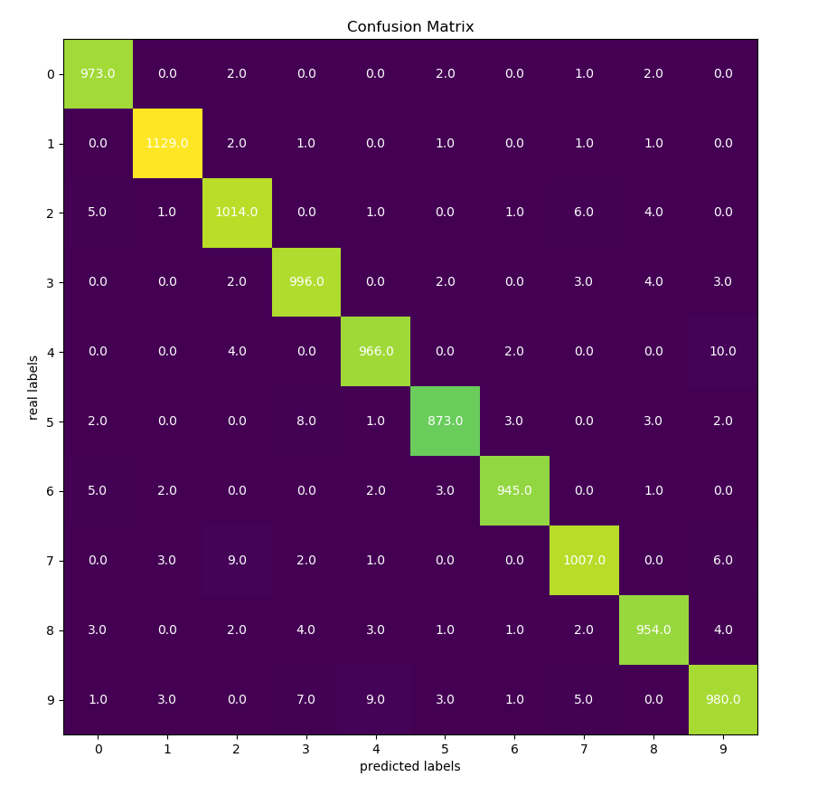

# ROB311_TP4

Train MNIST data set with SVM.SVC from Sklearn.

## Download the data

Download MNIST Dataset in zip file from this [link](https://www.kaggle.com/oddrationale/mnist-in-csv) (using the Download button).

Extract the zip files containing the train and test dataset.

In the current directory, create a folder ``data`` and put the two data sets in this folder.

## Train SVM

To train the SVM by the default value of parameters, run:

```bash
python svm.py
```

These are the parameters that can have different values:

```text
Argument to train SVM

optional arguments:
  -h, --help            show this help message and exit
  --c C                 penalty parameter of the error term
  --k {rbf,linear,poly,sigmoid}
                        Kernel type
  --gamma {auto,scale}  Kernel coefficient for ‘rbf’, ‘poly’ and ‘sigmoid’
  --train-size TRAIN_SIZE
                        The training set size. '-1' mean that we use all the
                        dataset
  --seed SEED           The random seed.
  --no-plot             Don't plot the confusion matrix
  --vb                  Turn on verbose
```

## Hyperparameters search

In SVM.SVC from Sklearn, there are three important hyperparameters:  `C`, `gamma` and `kernel`.
Each hyperparameters belongs to its list of possible values.

We use `hyperparameters_search.py` to find which of the three parameters gives the best accuracy.
Basically, we train svm for every possible combination of `C`, `gamma`, `kernel` of their list and we search for a set of {C, gamma, kernel} that maximizes the accuracy.

In terminal, run :

```bash
python hyperparameters_search.py
```

## Result

The size of training data is very large, so in hyperparameter searching, we use only 3000 training expample,
as a result, we find optimal hyperparameters:

```text
C:      10
kernel: "rbf"
gamma:  "scale"
```

with accuracy: `0.9692`.

Finally, we train the whole data with:

```bash
python svm.py --k rbf --c 10 --gamma scale --vb --train-size -1 --vb
```

We get the accuracy of: `0.9837`.

Training time: 557.9313 seconds.

Prediction time: 158.0967 seconds

The corresponding confusion matrix:


